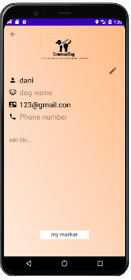
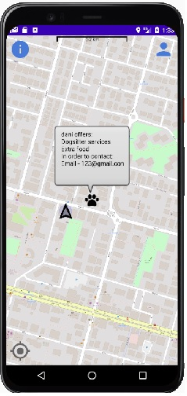

# CommuniDog
CommuniDog for Android connects guide-dog foster families using location-based services.
With CommuniDog, finding a guide-dog-friendly (and certified) doggy-sitter, sharing special medications or food for your fostered guide-dog is easy! 

Note: to keep our community safe and secure, only users approved by the community center for foster dogs are allowed.

    
    

## Notes for open-source contributers
* 
* The app is written in Android Studio (version 4.1 at least) using Java - Supported from API level 16 and more.
* We are using Firebase platform to restore all relevant data about users and app data.
* The map service is Open-Street Map Package
* The app requires an internet connection to work properly and works best with location services (GPS) enabled.
* Every change in the code, requires a proper and well documented pull request.

## Improvements and future goals:
### Low effort
* Keep and show profile pictures for users.
* Keep and show photo albums for users, to be shown on the profile page.
### Big(ger) effort
* Trainings-schedule planner
* Direct messages between users
* Finding partners for dog parks (notifying for the closest users, etc.)
#### feel free to add whatever you like, we will be happy to see what you have thought of.

## How to install the app:
* Install Android Studio: https://developer.android.com/studio/install.
* Clone this `github` repository: `git clone https://github.com/IdoSagiv/CommuniDog.git`
* Open the project via android studio.
* (Optional): Install Android Emulator and Android Virtual Device
  * Install Android Emulator - follow the instructions in https://developer.android.com/studio/run/emulator 
  * Install AVD - https://developer.android.com/studio/run/managing-avds
  * Note: This step is relevant to you if you want to run the widget on a virtual device instead on your real phone.
* Make sure to sync the 'build.gradle' files (in the app folder and in the main folder).
* You can choose to run the app on your phone or on an emulator that has an android os.
* For best results, we recommend running the app on your own android phone, or if not possible use pixel 3 emulator.
* To control your location in emulator - open the emulator, click on the 3 dots by it and then enter location to set emulator in.
* If you have any problem during the installation, see [Q&A page](https://github.com/IdoSagiv/CommuniDog/wiki/Q&A)

## instructions for running the app:
* Sign up, make sure to provide a valid Israeli ID number that is approved by the community center for foster dogs.
* Find your dog's service! 
**note** To try out the app, you can contact one of the founders to get login details of a dummy user
* To set up a new service, perform a long press anywhere on the screen. then, a new window pops up, where you
can edit your service or create a new one.
* To see more information about the israeli community center for foster dogs, click the 

                  
 button

## Founders
[Lotan Aharoni](https://github.com/lotanaharoni) [Hadas Aizik](https://github.com/hadasAizik) [Ido Sagiv](https://github.com/IdoSagiv)
